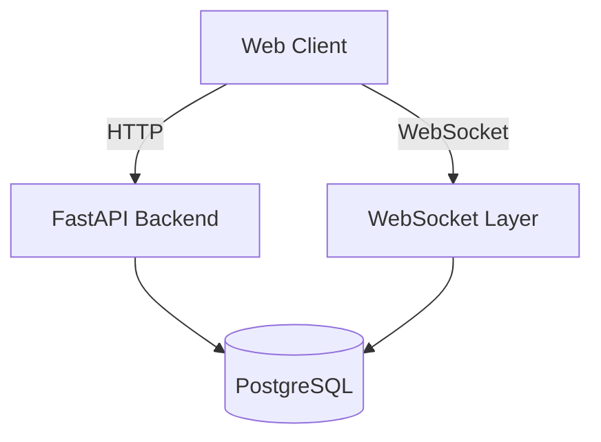
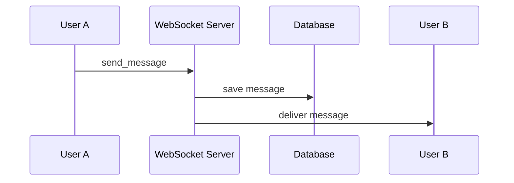

# 📌 Проект: MVP мессенджер (1-на-1)

---

## 1. 🎯 Бизнес-задача

Разработать минимально жизнеспособный продукт (MVP) мессенджера для обмена сообщениями между двумя пользователями в реальном времени.

### Цель:

* Проверить работоспособность решения
* Создать фундамент для дальнейшего развития
* Минимизировать затраты на разработку и инфраструктуру

---

## 2. 🧑‍💻 Пользовательские сценарии (User Flow)

### Основные:

1. Пользователь регистрируется
2. Пользователь авторизуется
3. Пользователь видит список пользователей
4. Пользователь открывает чат
5. Пользователь отправляет сообщение
6. Второй пользователь получает сообщение в реальном времени

---

## 3. 📦 Область реализации (Scope MVP)

### Включено:

* Регистрация и авторизация
* Чат 1-на-1
* Отправка и получение сообщений (real-time)
* Хранение истории сообщений

### Исключено (Backlog):

* Группы
* Файлы
* Звонки
* End-to-End шифрование
* Push-уведомления

---

## 4. 🏗 Архитектура решения

### Подход:

**Монолитная архитектура с разделением слоёв**

---

## 5. 📊 Диаграмма системы



---

## 6. 🧩 Компоненты системы

### 6.1 Клиент (Frontend)

* Web-приложение (React)
* Отвечает за UI и взаимодействие с API/WebSocket

---

### 6.2 Backend

* FastAPI
* Обрабатывает:

  * HTTP-запросы (REST API)
  * WebSocket соединения
  * бизнес-логику

---

### 6.3 База данных

* PostgreSQL
* Хранение пользователей и сообщений

---

## 7. 🔌 Коммуникации

### HTTP API:

* `/auth/register`
* `/auth/login`
* `/users`
* `/messages/history`

---

### WebSocket:

* `/ws/chat`

#### События:

* `send_message`
* `receive_message`

---

## 8. 🗄 Модель данных (обзор)

### Таблицы:

* users
* messages

---

## 9. 🔐 Безопасность

### Реализуется:

* HTTPS / WSS
* JWT авторизация
* Хеширование паролей (bcrypt)
* Проверка доступа к сообщениям

---

### Не реализуется (на этапе MVP):

* End-to-End шифрование
* Сложные криптопротоколы

---

## 10. ⚙️ Технический стек

### Backend:

* Python
* FastAPI

### База данных:

* PostgreSQL

### Клиент:

* React

### Протоколы:

* HTTP (REST)
* WebSocket

---

## 11. 🚀 Развёртывание (MVP)

### Инфраструктура:

* 1 VPS сервер
* Backend + DB на одном сервере

---

### Минимальные требования:

* Linux сервер
* Docker (опционально)

---

## 12. 📐 Внутренняя структура backend

```bash id="k3m91x"
/app
  /api
  /models
  /schemas
  /services
  /ws
  /setting
```

---

## 13. 🔄 Поток данных (Sequence)



---

## 14. 📏 Критерии готовности (Definition of Done)

* Пользователь может зарегистрироваться
* Пользователь может войти
* Сообщения отправляются и принимаются в реальном времени
* Сообщения сохраняются в базе данных
* Второй пользователь получает сообщение без обновления страницы

---

## 15. ⚠️ Ограничения

* Один сервер
* Нет масштабирования
* Ограниченное количество пользователей

---

## 16. 🧠 Ключевые решения

* Монолит вместо микросервисов
* WebSocket вместо polling
* PostgreSQL как основная БД
* Минимальная безопасность без перегрузки

---

## 17. ▶️ План перехода к реализации

1. Инициализация проекта (backend)
2. Настройка базы данных
3. Реализация авторизации
4. Реализация WebSocket
5. Реализация чата
6. Тестирование (ручное)

---

## 18. 📌 Результат

На выходе:

* Рабочий мессенджер (1-на-1)
* Готовая архитектурная база
* Основа для масштабирования

---
