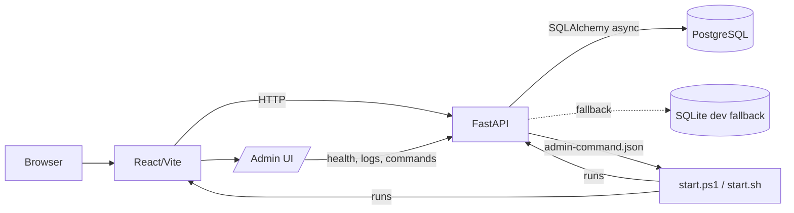
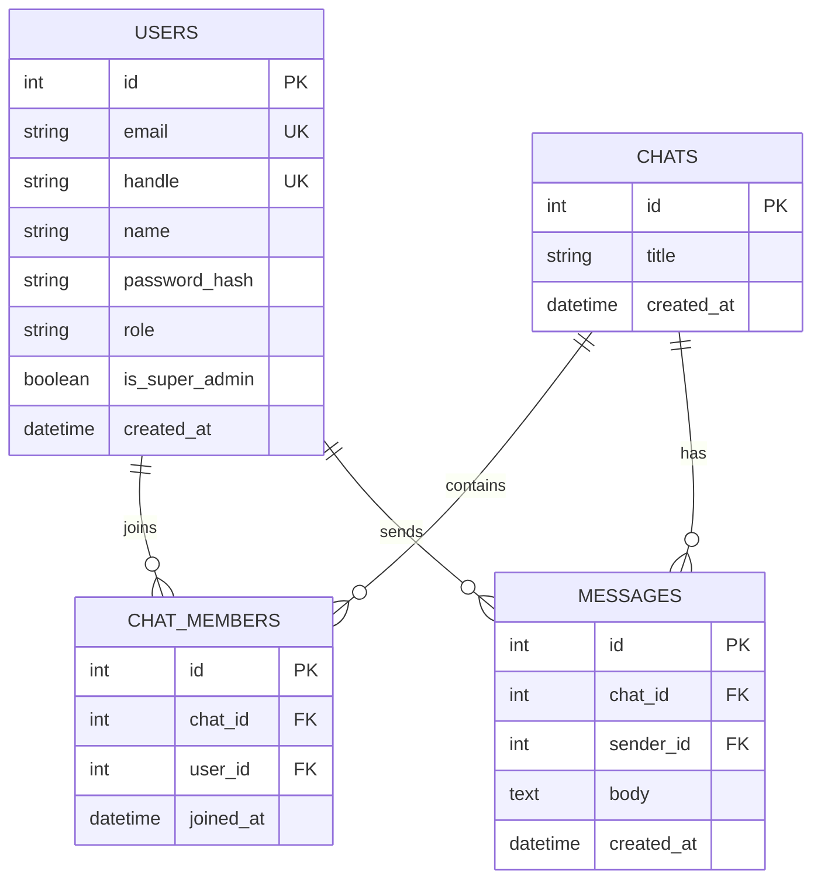
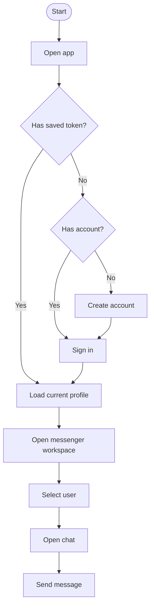

# Project_403

MVP приватного мессенджера с React/Vite frontend, FastAPI backend, PostgreSQL-моделью данных, JWT-аутентификацией и dev/admin-инструментами для локальной разработки.

## Навигация

- [Текущее состояние](#текущее-состояние)
- [Документация](#документация)
- [Быстрый старт](#быстрый-старт)
- [Адреса](#адреса)
- [PostgreSQL](#postgresql)
- [Команды](#команды)
- [API](#api)
- [Переменные окружения](#переменные-окружения)
- [Диаграммы](#диаграммы)
- [Проверки](#проверки)

## Текущее состояние

Реализовано:

- базовый frontend на React/Vite с RU/EN интерфейсом;
- backend на FastAPI с async SQLAlchemy;
- локальный PostgreSQL через Docker Compose;
- SQLite fallback для локальной разработки без PostgreSQL;
- регистрация и логин пользователей;
- вход по email или handle;
- JWT access token и endpoint текущего профиля;
- роли `owner/user` и признак `is_super_admin`;
- dev seed-пользователи для локальной разработки;
- rate limit для login/register;
- обработка истекшей frontend-сессии;
- admin panel для DEV-режима;
- состояние backend/frontend/Database в админке;
- runtime-state с накоплением общего времени запуска проекта;
- список логов с пагинацией максимум по 10 записей и сортировкой от новых к старым;
- dev-команды рестарта backend/frontend/project из админки;
- стартовые скрипты для Windows и Ubuntu/Linux.

Запланировано ближайшими эпиками:

- список пользователей;
- создание личных и групповых чатов;
- хранение и отображение истории сообщений;
- WebSocket realtime;
- индикаторы доставки, прочтения, typing и online/offline;
- тесты auth/admin/chat сценариев;
- production-профиль запуска ближе к боевому развертыванию.

## Документация

- [docks/plans.md](docs/plans.md) — рабочий план по эпикам и статусам.
- [docks/project-summary.md](docs/project-summary.md) — краткое описание текущего и планируемого функционала без технических команд. Этот документ можно использовать как источник summary для главной страницы.

## Быстрый старт

Windows:

```powershell
powershell -ExecutionPolicy Bypass -File .\start.ps1
```

Ubuntu/Linux:

```bash
chmod +x ./start.sh
./start.sh
```

Запуск вместе с PostgreSQL через Docker Compose:

```powershell
powershell -ExecutionPolicy Bypass -File .\start.ps1 -StartDb
```

```bash
./start.sh --start-db
```

Стартовые скрипты требуют готовый `.env`, создают `.venv`, обновляют `pip`, устанавливают Python/npm-зависимости, проверяют frontend-сборку и запускают backend + frontend.

Docker нужен только для локального PostgreSQL. Если Docker недоступен или PostgreSQL не поднят, backend может использовать временный SQLite fallback: `sqlite+aiosqlite:///./local.db`.

## Адреса

| Назначение | URL |
| --- | --- |
| Frontend | http://127.0.0.1:5173 |
| Admin UI | http://127.0.0.1:5173/admin |
| Backend | http://127.0.0.1:8000 |
| FastAPI docs | http://127.0.0.1:8000/docs |

## PostgreSQL

Для локальной БД добавлен [docker-compose.yml](docker-compose.yml).

Поднять только PostgreSQL:

```powershell
powershell -ExecutionPolicy Bypass -File .\start.ps1 -DbOnly
```

```bash
./start.sh --db-only
```

Или напрямую:

```bash
docker compose up -d db
```

Параметры dev-БД:

```text
host: localhost
port: 5432
database: messenger_db
user: postgres
password: password
```

Backend при старте пытается создать таблицы автоматически, если `AUTO_CREATE_TABLES=True`. Если PostgreSQL недоступен и `DB_FALLBACK_ENABLED=True`, таблицы будут созданы в локальном SQLite-файле `local.db`.

Создать таблицы вручную через API:

```bash
curl -X POST http://127.0.0.1:8000/api/db/init
```

Базовые таблицы:

- `users`
- `chats`
- `chat_members`
- `messages`

## Команды

### Стартовые скрипты

| Действие | Windows | Ubuntu/Linux |
| --- | --- | --- |
| Запуск | `powershell -ExecutionPolicy Bypass -File .\start.ps1` | `./start.sh` |
| Запуск с БД | `powershell -ExecutionPolicy Bypass -File .\start.ps1 -StartDb` | `./start.sh --start-db` |
| Только БД | `powershell -ExecutionPolicy Bypass -File .\start.ps1 -DbOnly` | `./start.sh --db-only` |
| Только подготовка | `powershell -ExecutionPolicy Bypass -File .\start.ps1 -InstallOnly` | `./start.sh --install-only` |
| Проверить сборку | `powershell -ExecutionPolicy Bypass -File .\start.ps1 -BuildOnly` | `./start.sh --build-only` |
| Обновить repo | `powershell -ExecutionPolicy Bypass -File .\start.ps1 -UpdateRepo` | `./start.sh --update-repo` |
| Принудительно npm install | `powershell -ExecutionPolicy Bypass -File .\start.ps1 -ForceInstall` | `./start.sh --force-install` |
| Принудительно build | `powershell -ExecutionPolicy Bypass -File .\start.ps1 -ForceBuild` | `./start.sh --force-build` |

Запуск на других портах настраивается только через `.env`:

```env
FRONTEND_PORT=18001
PORT=18000
VITE_API_URL=http://127.0.0.1:18000
```

### Frontend

```bash
npm ci
npm run dev
npm run lint
npm run build
```

### Backend

Windows:

```powershell
py -3 -m venv .venv
.\.venv\Scripts\python.exe -m pip install --upgrade pip
.\.venv\Scripts\python.exe -m pip install -r requirements.txt
.\.venv\Scripts\python.exe -m uvicorn app.start:app --host 127.0.0.1 --port 8000
```

Ubuntu/Linux:

```bash
python3 -m venv .venv
.venv/bin/python -m pip install --upgrade pip
.venv/bin/python -m pip install -r requirements.txt
.venv/bin/python -m uvicorn app.start:app --host 127.0.0.1 --port 8000
```

## API

| Method | Path | Назначение |
| --- | --- | --- |
| `POST` | `/api/auth/register` | Регистрация пользователя |
| `POST` | `/api/auth/login` | Логин по email или handle |
| `GET` | `/api/users/me` | Текущий профиль по bearer-токену |
| `GET` | `/api/admin/health` | Runtime status: version, env, branch, backend stack |
| `GET` | `/api/admin/logs` | Список логов с пагинацией |
| `GET` | `/api/admin/logs/{date}/{file}` | Скачать файл лога |
| `GET` | `/api/admin/commands` | Список доступных admin-команд |
| `POST` | `/api/admin/commands/{command_id}` | Поставить admin-команду в очередь |
| `GET` | `/api/admin/check` | Проверка GET |
| `POST` | `/api/admin/check` | Проверка POST |
| `PUT` | `/api/admin/check` | Проверка PUT |
| `PATCH` | `/api/admin/check` | Проверка PATCH |
| `DELETE` | `/api/admin/check` | Проверка DELETE |
| `GET` | `/api/db/check_connect` | Проверка подключения к БД |
| `POST` | `/api/db/init` | Создание таблиц |

Admin command API доступен только в DEV-режиме пользователю с ролью `owner` и `is_super_admin=True`.

## Переменные окружения

`.env` является обязательным локальным файлом настроек и основной точкой управления проектом. Файл игнорируется git. Если файла нет, стартовый скрипт остановится с ошибкой без раскрытия имени файла настроек.

`.env` - единая точка управления запуском, сборкой, секретами и dev/prod режимом. Для открытой локальной разработки оставьте `ENVIRONMENTS=DEV`. Для закрытого production-режима поменяйте этот же файл на `ENVIRONMENTS=PROD` и задайте реальные секреты.

Ключевые группы в `.env`:

- application: `APP_NAME`, `VERSION`, `ENVIRONMENTS`;
- server/runtime: `HOST`, `PORT`, `FRONTEND_HOST`, `FRONTEND_PORT`, `CORS_ORIGINS`;
- frontend build: `VITE_API_URL`, ключи local/session storage и дефолты интерфейса;
- database: `DATABASE_DRIVER`, `DB_USER`, `DB_PASSWORD`, `DB_HOST`, `DB_PORT`, `DB_NAME`, `DB_FALLBACK_ENABLED`, `DB_FALLBACK_URL`;
- auth/secrets: `JWT_SECRET`, `JWT_ALGORITHM`, `ACCESS_TOKEN_EXPIRE_MINUTES`, rate limits;
- dev accounts: `DEV_SUPERUSER_*`, `DEV_USER_*`;
- logging/admin/runtime state: `LOG_*`, `RUNTIME_*`, `ADMIN_COMMAND_*`.
- mode-derived behavior: `DEBUG`, `AUTO_CREATE_TABLES` and admin restart commands are derived from `ENVIRONMENTS`.

Правила для секретов:

- `.env` является единственным источником настроек сервера, базы данных, запуска, сборки, секретов и frontend runtime ключей.
- `.env` хранится локально и игнорируется git; production-секреты надо задавать только в контролируемом окружении.
- Production должен получать параметры базы, `JWT_SECRET` и будущие SMTP/OAuth/storage ключи из этого `.env`, а не из JSON-конфигов.
- Переменные `VITE_*` считаются публичными, потому что попадают во frontend bundle.
- `/api/admin/health` не должен отдавать приватные значения.

Production-режим включается при `ENVIRONMENTS=PROD` или `ENVIRONMENTS=production`:

- `DEBUG` автоматически выключается;
- `AUTO_CREATE_TABLES` автоматически выключается;
- admin restart commands автоматически выключаются;
- dev seed users не отключаются режимом и остаются под контролем `DEV_SUPERUSER_ENABLED` / `DEV_USER_ENABLED`;
- SQLite fallback остается доступным при `DB_FALLBACK_ENABLED=True`, если PostgreSQL недоступен.

Production-валидация блокирует только явно небезопасные настройки:

- SQLite как основную базу;
- `JWT_SECRET=change_me_before_public_deploy`;

Перед публичным deploy надо заменить `JWT_SECRET`, параметры базы и другие значения окружения на реальные. Для переключения режима достаточно изменить `ENVIRONMENTS`.

## Диаграммы

### Архитектура



### ERD



### Основной пользовательский сценарий



## Проверки

Frontend:

```bash
npm run lint
npm run build
```

Backend:

```powershell
.\.venv\Scripts\python.exe -m compileall app
```

Ubuntu/Linux:

```bash
.venv/bin/python -m compileall app
```
